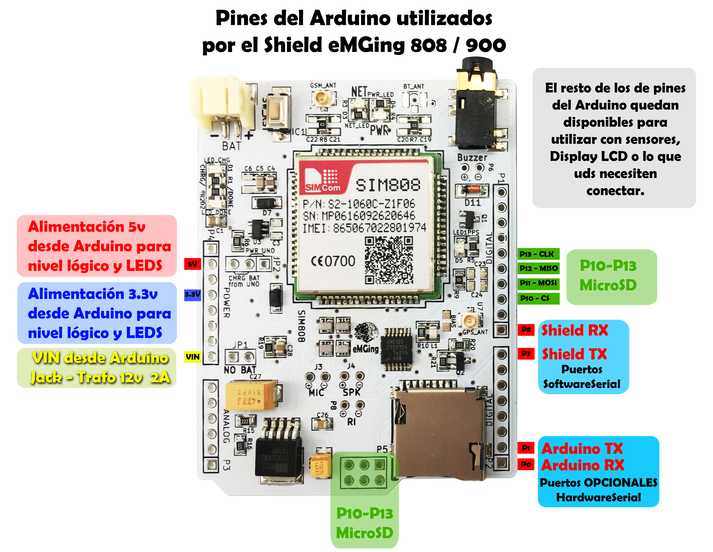

# Librería eMGing para Shield eMGing 900/808

--(Esta librería requiere Arduino v1.0.6 o superior)--

Esta librería se codeo especialmente para manejar los dos Shields GSM-GPRS que desarrolló eMGing
Nuestra filosofía en eMGing, al igual que Arduino es el Hardware y Software abierto, por lo 
que no reinventamos la rueda, si existe ya algo bien hecho, lo tomamos y en todo caso lo mejoramos
Esta librería se armo en base a muchas librerías que estan dando vuelta por internet, tomando
lo mejor de cada una, para sacar mejor provecho de ésto, y mejorandola para el provecho y uso de 
nuestros clientes.

Desarrollada especialmente para trabajar con los módulos Shield eMGing GSM-GPRS
  * http://www.emging.com.ar/product/shield-emging-808-gsm-gprs-2g-gps-usd-arduino-iot/
  * http://www.emging.com.ar/product/shield-emging-900-gsm-gprs-2g-usd-arduino-iot/

Por Gustavo Marek para eMGing Electrónica Argentina.  
Licencia BSD, Todo el texto aquí descripto debe estar incluído en cualquier tipo de distribución de esta u otra librería

Ubicar la carpeta de la librería ( que debe incluír los archivos: eMGing_900-808.cpp e eMGing_900-808.h ) y colocarla en la
siguiente ubicación: " documentos/Arduino/librerías/ " si no existe crear la subcarpeta y luego de copiar alli la librería
reiniciar el IDE Arduino para que tome la nueva librería.

Entren a la página oficial donde encontrarán los tutoriales y los esquemas de conexión para ambos módulos,
o pueden ver los links siguientes para entrar directamente:

  * http://www.emging.com.ar/2016/07/06/shield-gsm-gprs-sim900/
  * http://www.emging.com.ar/2016/07/20/shield-gsm-gprs-gps-sim808/